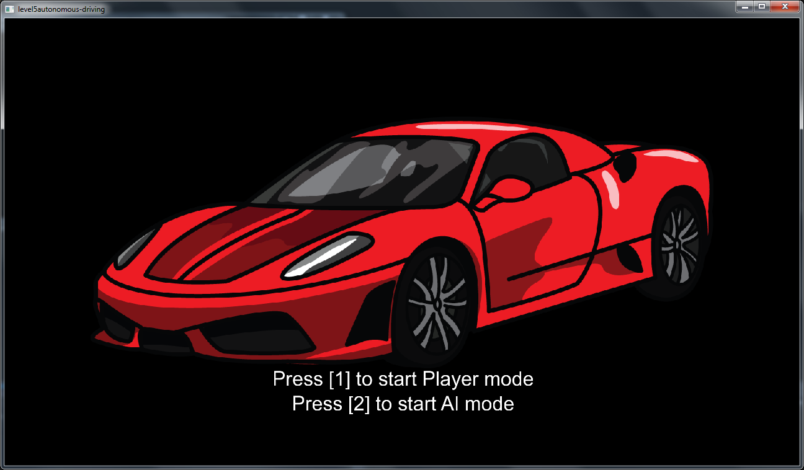

# level5autonomous-driving

The car controller using fuzzy logic. Graphics based on SFML. Below some screenshots: 

Go and check [the fuzzy logic rules] to discover more how the controller works.

Another idea, and also more complicated, for the fuzzy logic controller based on taking wide turns, you can check [here].

[the fuzzy logic rules]: fuzzy-rules/Fuzzy_rules_basic_rules.pdf
[here]: fuzzy-rules/Fuzzy_rules_wide_turns_rules.pdf
